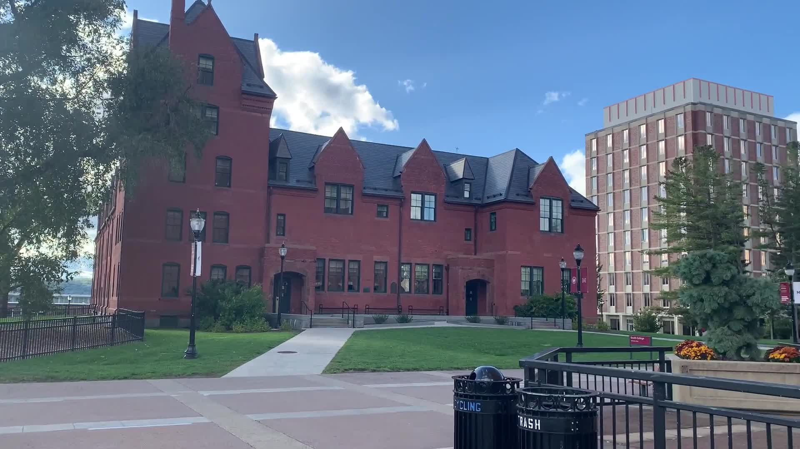
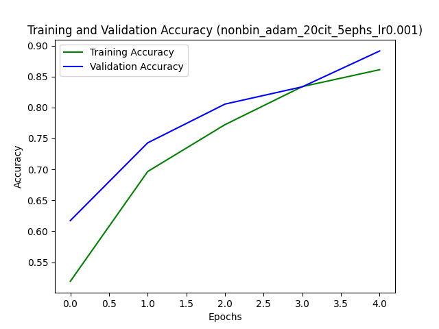
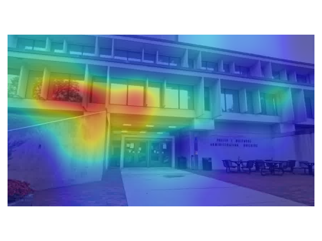

# 🏙️ What Makes Amherst Look Like Amherst?

> **COMPSCI 682 - Computer Vision Project**  
> University of Massachusetts Amherst  
> By [Preston Yee](https://github.com/PYee1999) & [Mehak Virender Nargotra](mailto:mnargotra@umass.edu)

This project applies **ResNet-based classification and Class Activation Mapping (CAM)** to explore and identify visual features that make **Amherst, MA** distinct from other cities around the world.

---

## 💡 Project Overview

We trained a deep learning pipeline on images from **Amherst** and **19+ other cities** using techniques like:

- **Binary and Multiclass ResNet classification**
- **CAM, GradCAM, and SmoothGradCAM** visualizations
- Custom data collection using YouTube videos and original Amherst footage
- Torch DataLoaders, transformations, and augmentation

  
<sub>**Figure 1:** Sample images from 6 cities including Amherst, Amsterdam, and Venice</sub>

---

## 🧠 Methodology

1. **Dataset Collection**  
   - 10,000 Amherst images captured from UMass and town footage  
   - 5,000+ images each from cities like Venice, Pune, Paris, Boston, and more

2. **Model Training**  
   - Pretrained **ResNet50** with custom classifiers  
   - Trained using both Binary Cross Entropy and Cross Entropy losses  
   - Multiple hyperparameter variations: Optimizer (Adam, SGD), Epochs (5, 10), Partitioning (Binary/Multiclass)

3. **Visualization**  
   - Applied **CAM techniques** to validate and interpret learned representations
   - Heatmaps illustrate features like the **Du Bois Library**, **campus architecture**, etc.

  
<sub>**CAM (Binary, Adam, 5 epochs):** Best model with 68% accuracy. Highlights include UMass buildings and layout.</sub>

  
<sub>**SmoothGradCAM:** Finer attention to patterns like triangular rooftops and window alignments</sub>

---

## 🚀 Running the Code

1. **Download the Dataset**  
   👉 [Google Drive Link](https://drive.google.com/file/d/1llG0ntOjmZED_qRNqmnXFgRIUY-E7ALy/view?usp=sharing)

2. **Unzip and Configure Paths**  
   Set `Binary_Dataset` and `Nonbinary_Dataset` paths inside `main()` in `code/run.py`.

3. **Execute the Program**  
   ```bash
   python3 ./code/run.py
